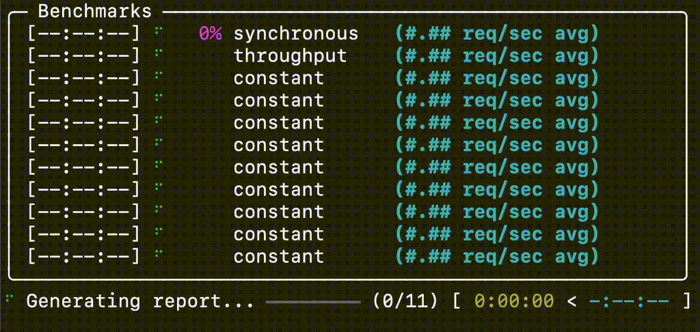

# Run a Benchmark

After [installing GuideLLM](install.md) and [starting a server](server.md), you're ready to run benchmarks to evaluate your LLM deployment's performance.

Running a GuideLLM benchmark is straightforward. The basic command structure is:

```bash
guidellm benchmark --target <server-url> [options]
```

### Basic Example

To run a benchmark against your local vLLM server with default settings:

```bash
guidellm benchmark \
  --target "http://localhost:8000" \
  --data "prompt_tokens=256,output_tokens=128"
```

This command:

- Connects to your vLLM server running at `http://localhost:8000`
- Uses synthetic data with 256 prompt tokens and 128 output tokens per request
- Automatically determines the available model on the server
- Runs a "sweep" benchmark (default) to find optimal performance points

During the benchmark, you'll see a progress display similar to this:



## Understanding Benchmark Options

GuideLLM offers a wide range of configuration options to customize your benchmarks. Here are the most important parameters you should know:

### Key Parameters

| Parameter       | Description                                    | Example                                        |
| --------------- | ---------------------------------------------- | ---------------------------------------------- |
| `--target`      | URL of the OpenAI-compatible server            | `--target "http://localhost:8000"`             |
| `--model`       | Model name to benchmark (optional)             | `--model "Meta-Llama-3.1-8B-Instruct"`         |
| `--data`        | Data configuration for benchmarking            | `--data "prompt_tokens=256,output_tokens=128"` |
| `--rate-type`   | Type of benchmark to run                       | `--rate-type sweep`                            |
| `--rate`        | Request rate or number of benchmarks for sweep | `--rate 10`                                    |
| `--max-seconds` | Duration for each benchmark in seconds         | `--max-seconds 30`                             |
| `--output-path` | Output file path and format                    | `--output-path results.json`                   |

### Benchmark Types (`--rate-type`)

GuideLLM supports several benchmark types:

- `synchronous`: Runs requests one at a time (sequential)
- `throughput`: Tests maximum throughput by running requests in parallel
- `concurrent`: Runs a fixed number of parallel request streams
- `constant`: Sends requests at a fixed rate per second
- `poisson`: Sends requests following a Poisson distribution
- `sweep`: Automatically determines optimal performance points (default)

### Data Options

For synthetic data, you can customize:

- `prompt_tokens`: Average number of tokens for prompts
- `output_tokens`: Average number of tokens for outputs
- `samples`: Number of samples to generate (default: 1000)

For a complete list of options, run:

```bash
guidellm benchmark --help
```

## Working with Real Data

While synthetic data is convenient for quick tests, you can benchmark with real-world data:

```bash
guidellm benchmark \
  --target "http://localhost:8000" \
  --data "/path/to/your/dataset.json" \
  --rate-type constant \
  --rate 5
```

You can also use datasets from HuggingFace or customize synthetic data generation with additional parameters such as standard deviation, minimum, and maximum values.

By default, complete results are saved to `benchmarks.json` in your current directory. Use the `--output-path` parameter to specify a different location or format.

Learn more about dataset options in the [Datasets documentation](../guides/datasets.md).
